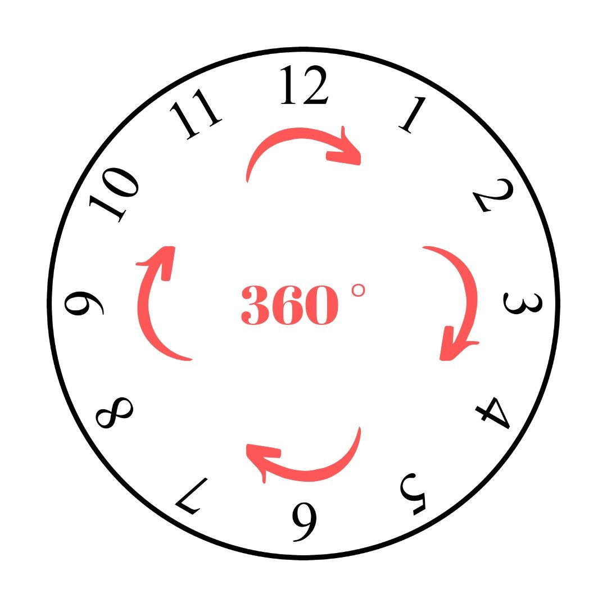

# Test Neomind   

### Summary  
 - [Proposed problem](www.google.com.br)  
 - [What I want to solve](www.google.com.br) 
-  [How I solved](www.google.com.br)

  
## Proposed problem
**Idea:** Write a program that by a given time, can calculate the angle between the two clock pointers.
**Consider:**
• 00:00h has 0° as result.
• 00:15h  has 45° as result.
• 00:30h  has 180° as result.
**Structure:** The following code was given to be an example of desired method:
`public long returnAngleClock(GregorianCalendar time);`

## What I want to solve
After reading a couple of times, I came up with some ideas and questions:

 1. It is not specified which angle between the two pointers is wanted, ~~bigger one or the smallest one~~ so I choose to deal with **the smallest one**, as it is more useful. 
 2. By the examples given to consider, I realized that they do not care about how the hours-pointer is affected by the minutes-pointer. For example, taking *1:30 AM* as our time: The hours-pointer will be in the middle of 1 and 2, because the minutes-pointer is at exactly the half of the clock. I decided to consider this extra detail while creating the program, so it will be more realistic and will give more accurate angles.\
 3. The method has a `long` as it's primitive return type, so we are limited to deal only with exact 'big' angles, but we are not able to deal with decimal results, so I decided to change it to another primitive type (double), and now er are able to handle numbers with fractional values.

## How I solved

I started by thinking what matters when the objective is to calculate the angle between two points in a circle surface (clock). So, the first step was to discover both angles and I made this by using the idea expressed in the picture:  
  

A complete circle has 360°. So, the clock is divided into 12 equal parts, what lead us to the following conclusion:  
  

Now that we know the equivalence that every 1 hour = 30°, we are going to do the same to minutes, using the following logic:
We will divide the clock into 60 parts, as one complete turn of the minutes-pointer represents a complete hour.
So, doing 360°/60 we get 6° every minute.  
  

Now we are going to convert minutes into hours, and add it to the hours. (as said before on item 3), I want to consider this extra movement made by the hours-pointer.  
So we have: 1:30 PM -> 1 hour + 0.5 hour = 1.5 hours `(30 minutes / 60 minutes =  0.5 hours)`  
And we also adjust the hours to be in 12-format by verifying if its bigger than 12 and then converting it by reducing 12. 

One of the last steps is to verify which one is the biggest, so we will reduce the smaller from it to get only the internal angle. It can be easily understood by the image:  
  

To finish, we are going to verify if he got the right angle (internal and smaller), or the wrong one (external and bigger) by verifying if the angle is bigger than 180, that is the biggest possible angle respecting our rule.
If we got the bigger one, just subtracting it from a complete circle will result in the smaller one automatically.

### Thanks for reading 😉 